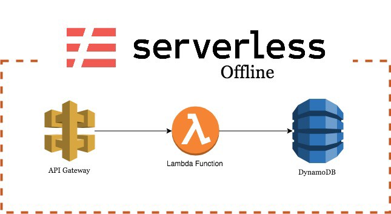

In this post, we are going to setup an environment with API Gateway, Lambda and DynamoDB using serverless framework which can be deployed to AWS directly or run fully local.

What are the advantages of using offline:

- Develop stress free without unexpected fees
- No need to wait for the deployment to finish to test every single change.
- Easier local debugging.
- When you’re ready, it takes just one command to deploy everything to AWS

You can also check the repositories of the individual plugins for more detailed information: [serverless](https://github.com/serverless/serverless), [serverless-offline](https://github.com/dherault/serverless-offline) and [serverless-dynamodb-local](https://github.com/99xt/serverless-dynamodb-local).

#### Setting up serverless framework

Start with installing serverless framework if you have not already

```
npm install -g serverless
```

and setup your AWS credentials. You can create your key and secret from AWS Console

```
sls config credentials --provider aws --key \<KEY\> --secret \<SECRET\>
```

We’re all set to create our serverless project

```
serverless create --template aws-nodejs --path test-serverless
```

This will create a serverless.yml file which contains the definition of our resources and example lambda function in handler.js

At this point, you can deploy it to AWS using the below command in the project’s root folder

```
cd test-serverless
serverless deploy
```

As simple as that. But we’ll continue with setting up a local development environment.

#### Setting up the local development environment

We need two plugins here;

- serverless-offline which emulates AWS Lambda and API Gateway
- serverless-dynamodb-local which runs a local DynamoDB.

```
npm install serverless-offline serverless-dynamodb-local --save-dev
```

Next step is updating our serverless.yml file. We changed runtime to nodejs8.10 to use the latest features, added a trigger for our lambda function and also added plugins section. Note that order is important in the plugins section.

`gist:068004266504369680dbb58c4df2c7e3`

after adding plugins, we need to install DynamoDB local in the project folder

```
serverless dynamodb install
```

now it’s time to run our local serverless. If you see a similar output, it means your setup was successful. You have your local DynamoDB instance running at localhost:8000, your local server is running at localhost:3000 and you have one endpoint at the root.

```
\> serverless offline start
Dynamodb Local Started, Visit: [http://localhost:8000/shell](http://localhost:8000/shell)
Serverless: Starting Offline: dev/us-east-1.

Serverless: Routes for hello:
Serverless: GET /

Serverless: Offline listening on [http://localhost:3000](http://localhost:3000)
```

Try hitting [http://localhost:3000](http://localhost:3000), you should see the output of the lambda function.

#### Integrating with local DynamoDB

We need to make the following changes to our serverless.yml file.

1. add an environment variable for the table name which we’ll use it in the template as well as in our nodejs code.
2. Replace functions section with two new functions; one for getting the users from dynamo and other for creating new users.
3. Add resources section which has the definition of our table
4. Set some flags in custom section for our local DynamoDB. Setting migrate to true will create the tables on start.

`gist:70d295e86e9006b98e22c94e12534eb7`

#### Updating lambda functions

Let’s update our lambda functions to read/write to the table we defined above.

serverless-offline plugin sets IS\_OFFLINE environment variable to true. We’ll use it to decide if we want to connect to the local dynamo instance or the one in AWS. In other words, if we run serverless offline start, it will connect to the local DynamoDB, but once we deploy it to AWS, it will use the actual DynamoDB table.

Then we have our lambda functions: usersGet will return all entries in the table while usersCreate will add new entries.

If you’re not familiar with async/await, you can quickly check it [here](https://developer.mozilla.org/en-US/docs/Web/JavaScript/Reference/Statements/async_function). Since we changed our runtime to nodejs8.10 in serverless.yml, we can use this cool feature.

`gist:330cfd207751f558231a3003eb0d9510`

It’s time to restart the offline server. This time, it should create the table and show two endpoints / and /create

```
\> serverless offline start
Dynamodb Local Started, Visit: [http://localhost:8000/shell](http://localhost:8000/shell)
Serverless: DynamoDB - created table test-serverless-dev-Users
Serverless: Starting Offline: dev/us-east-1.

Serverless: Routes for usersGet:
Serverless: GET /

Serverless: Routes for usersCreate:
Serverless: GET /create

Serverless: Offline listening on [http://localhost:3000](http://localhost:3000)
```

We’re all set. Let’s open [http://localhost:3000/create](http://localhost:3000/create) and refresh a couple of times to create new users. And now hit [http://localhost:3000/](http://localhost:3000/) and see all the create users.

You can also deploy it to AWS with serverless deploy, but don’t forget to add necessary IAM roles for your lambda functions to access DynamoDB.