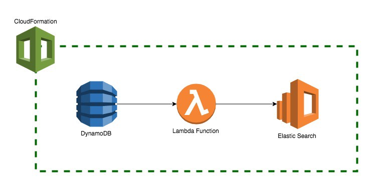

DynamoDB is Amazon’s NoSQL database which offers single-digit milliseconds latency. It is great for variety of use cases, but when you need to run complex search queries on your dataset, you quickly realise it is not designed for it.  
   
You can try using composite primary keys, local and global secondary indexes to fulfil your needs. But as the queries get more complex, you might realise those are not enough. But don’t worry, you are not alone. Lots of people who have faced with this problem chose a similar solution; using ElasticSearch for their complex search operations while keeping the DynamoDB as the authority for the data.  
   
Here we are going to learn how ElasticSearch can be plugged into your DynamoDB with a click of a button using CloudFormation.

The same steps can be done using AWS Web Console, but I think making use of CloudFormation is better as often times you need to create the same resources for multiple stages and regions.

### Creating DynamoDB Table

Let’s start with creating a DynamoDB table using CloudFormation. Here we create a table called ‘OrderTable’ whose key is orderId. It also sets read/write capacity to 5. One of the most important things here is that we also enable DynamoDB streams. Whenever an entry is created or updated, it will be streamed automatically. It will only return the new image, but you have [other options](https://docs.aws.amazon.com/amazondynamodb/latest/APIReference/API_StreamSpecification.html) if you also need the old image or just the keys.

`gist:0ce057b395b5c3ae88e79b6da08236b6`

If you already have an existing table and don’t want to create a new one, you can get its SourceArn from AWS Web Console, and use it in the following sections.

### Adding a Lambda function

Here we print the records coming from DynamoDB stream. We also add a Role to access various AWS resources from our lambda function which we’ll cover later. We use ZipFile which allows adding inline code to our CloudFormation template.

`gist:0c4add0c9c275d8e726df7db47f0e498`

### Mapping between the stream and lambda function

This defines the mapping between DynamoDB Stream and our Lambda function. Whenever there is something new in DynamoDB Streams, it will trigger our lambda function with those records.

`gist:aea2be7119a77d3fcecd25872fbdf0ae`

### Lambda IAM role

Here we give our lambda function access for writing logs so that we can check them in CloudWatch and also access for reading DynamoDB streams.

`gist:2c9bdd95e66a9226a34e61ca4f1f6a0c`

### Adding ElasticSearch

This creates a t2.micro ElasticSearch instance which is included in Free Tier. It also allows LambdaRole to access to the instance.

`gist:0de4b21eaf7c4b03f31b700bafc03c65`

### Updating Lambda to index documents

Now let’s update our previous lambda function to index DynamoDB stream records to ElasticSearch. Note that we need to sign our requests, otherwise you’ll get an authorization error.  
  
Consider using [http-aws-es](https://github.com/TheDeveloper/http-aws-es) library which makes things quite easy if you are using S3Bucket and S3Key instead of ZipFile. It allows you to use [elasticsearch-js](https://github.com/elastic/elasticsearch-js) client and also handles the request signing part.

`gist:0f3a80a2e5c069e2dcbf8a321d7d659d`

So at this point we have everything we need. All the new DynamoDB data is being indexed to ElasticSearch behind the scenes.  
   
You can also see the full CloudFormation template [here](https://gist.github.com/merictaze/44cb99335300fb1121512eb9beea3ab3)

Feel free to comment below if you have any questions or feedback.