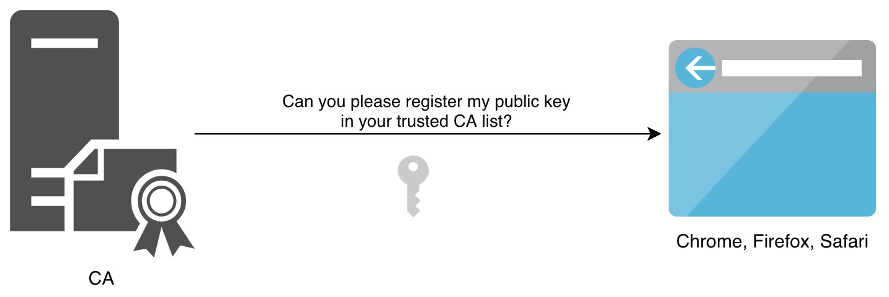
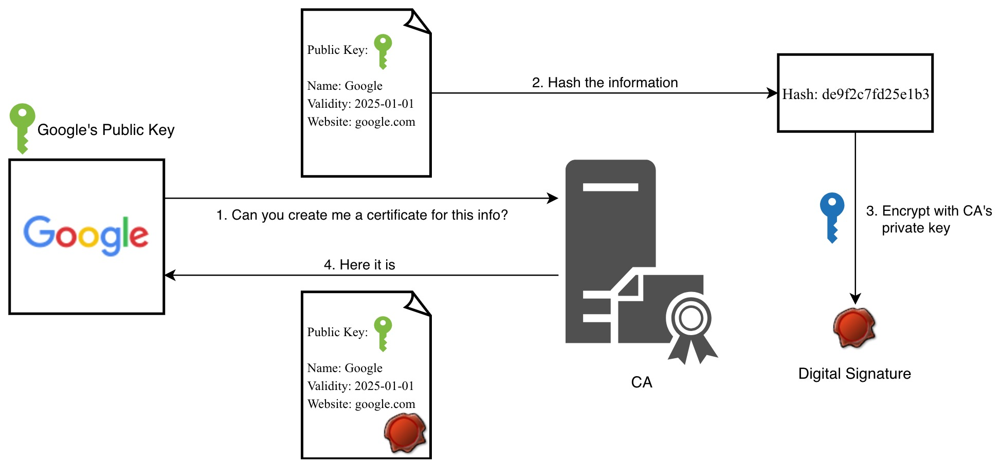
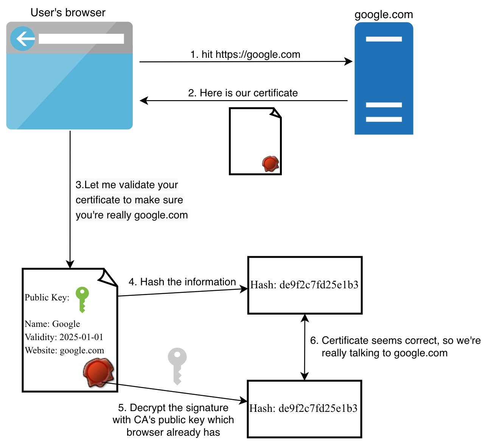
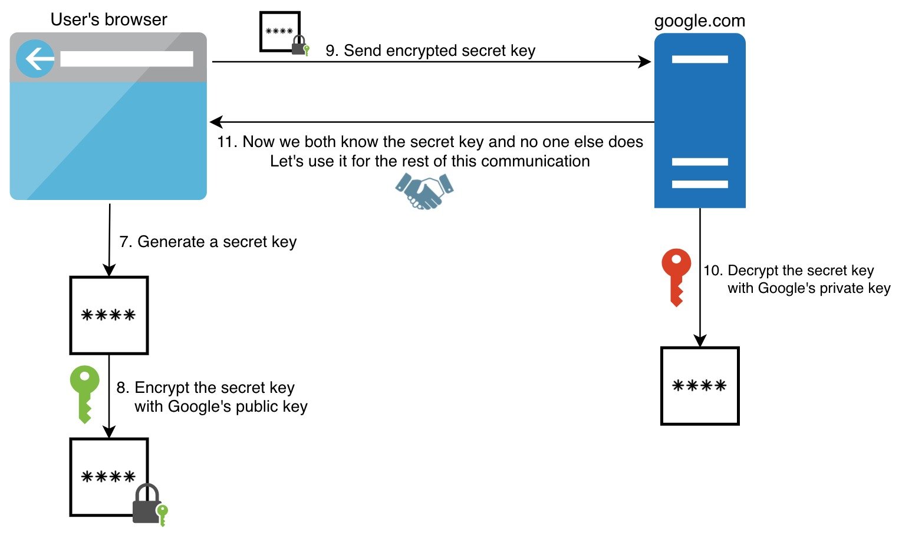

While making a simple request to https://google.com to see that simple search page, there are a lot of things going on behind the scenes to keep you secure. Understanding this flow will give you a lot of confidence in various topics like Digital Certificates and Signatures, Symmetric/Asymmetric key encryptions, Certificate Authorities and how they all work together to help you have secure communication. Let’s start with some fundamental concepts that HTTPS relies on

<figcaption>Photo by <a href="https://unsplash.com/@rubavi78">Rubén Bagüés</a> on <a href="https://unsplash.com">Unsplash</a></figcaption>

## Encryption Algorithms

Encryption is needed to securely transfer/store the data in case malicious parties gain access to your data either in transit or at rest.

### Symmetric-Key Encryption

You and your old friend Alice want to talk about some secret stuff via mail. Since it has secret stuff, you don’t want anyone else to read it. You go and buy a locker with two identical keys. You give one of them to Alice. You put your letters inside the locker, lock it with your key, and send it to Alice. Alice uses her key to unlock the locker and read the mail. Then, she puts her reply into the locker, locks it with her key and sends it back to you. This is similar to what happens with symmetric-key encryption.

The same key is used to both encrypt and decrypt the data. It’s not as mathematically complex as asymmetric keys, but it’s faster for the same reason.

After buying the locker with two identical keys, how would you give one of the keys to Alice securely? The biggest shortcoming of this type of algorithms is key distribution. It does not offer a secure way to send the key to the other party.

### Asymmetric-Key Encryption

This time, you’re getting smarter. You buy a locker with a unique key for yourself. You send your locker to Alice and don’t send your key to anywhere and keep it somewhere secure. Alice puts her letter into your locker and puts the lock on, then sends it back to you. You use your key, the only key to open the locker, and unlock the locker. What if you need to send a letter to Alice? Then, she needs to buy her own locker with a unique key and send the locker to you. Voilà, the key distribution problem solved. This will give you an idea of how asymmetric-key encryption works.

Different keys are used to encrypt and decrypt the data, called public and private keys. While the public key(unlocked locker) can be shared with anyone, the private key(unique locker key) is kept as private. Anything encrypted with the public key can be decrypted by the private one, and vice versa.

### Hybrid Encryption

This one tries to get the best of both algorithms above. It uses asymmetric-key encryption to achieve key distribution of the secret key and uses symmetric-key encryption(secret key) for the rest of the communication which is faster.

This time there are two things

* Your locker and your unique key (or Alice’s locker and her unique key)

* A shared locker with two identical keys.

Alice buys a shared locker with two identical keys. You send your locker to Alice. Alice puts one of the identical keys of the shared locker inside and sends it back to you. You unlock the locker with your unique key. You see that shiny key inside the locker. Congratulations, now you securely received one of the identical keys. Going forward, you only need the shared locker and the identical keys to communicate securely.

Yes, that’s what’s happening in hybrid encryption. It uses asymmetric-key encryption(public-private key) to securely transfer the symmetric key(secret key). Then both parties use the secret key to encrypt/decrypt the data. This is also what’s used in HTTPS as we’ll see in the next sections.

## Certificate Authority

When you go to your bank, and say *“Hey, I’m John Doe, please give me some money from my account”*, the first thing they do is asking a piece of Id. When you show your Gym membership card with your name on it, they’ll say *“Please show us a government-issued Id”* as they don’t consider your Gym as a trusted authority. Once you show your government-issued Id, they believe you as they trust to the government and let you withdraw money.

Same story goes here. When you type [https://google.com](https://google.com) into your browser’s address bar, it gets a response saying that *“Hey, I’m Google, please send your username and password to me”*. But how do you know it’s actually Google, but not someone else. You need an authority like the government to validate Google’s identity, and that’s exactly where CAs come into the picture. They’re the trusted authority and your browser uses CAs to make sure you’re talking to the correct website. If the certificate was issued by some other authority (like your Gym), browser will let you know saying something like “Your connection is not private: Attackers might be trying to steal your information … NET::ERR_CERT_AUTHORITY_INVALID”.

While the government is the trusted authority in the country and you register yourself with them when you’re born and use your Id card to validate your identity wherever needed, CAs are the trusted authority for certificates and you register your website’s info with them and use your certificate to prove your website’s identity.

## Digital Certificate and Signature

This time, you’re preparing documents for your passport application. Since you don’t have time to apply in person, you decided to send the documents via mail. But, just by looking at some document, how would government officials know it’s really sent by you. What if someone else filled the form with your info and asking the passport to be sent to his address once it’s ready?

To make sure it’s really you sending these documents, they require a notary public witnessing the signing of the documents and verifying their authenticity. So, you sign the document in front of a notary public and he certifies the document by signing and stamping it as well. He also keeps a copy of it in case later government needs to validate the copy they received is what certifier had certified.

The part they signed and stamped is the **Signature** and the certified document which contains the initial info you provided and their signature is the **Certificate**.

Since it’s digital, things are slightly different. To make sure the info wasn’t altered, the certifier hashes the info. This hash can be called the data fingerprint as it uniquely identifies the info. If something changes in the info, the hash will change too. *“That’s great, but what if someone changes the info then puts the new hash for the new info, how you’d know it wasn’t altered?”*. That’s a great point, that’s why just hashing is not enough. Certifier also encrypts the hash with his private key. And this encrypted hash (and some more metadata) is the **Digital Signature**. Now put that digital signature into the initial info, and you get the **Digital Certificate**.

Now whoever needs to validate the info, they can

* hash the info by themselves

* Decrypt the digital signature with certifier’s public key to get the calculated hash by the certifier

* Compare the two values if they’re the same

---

Before going into the actual flow at the time you visit google.com, we’ll see how CAs and Google’s certificate was setup long before you visit Google in the first two sections.

## 1. Registering Certificate Authorities

Trusted CAs provide their public keys to browsers. That means when you install a new browser, it already has a list of CAs and their public keys.

*Why do we need CAs public key?* Great question! When you visit google.com and it sends you back its certificate, part of which is encrypted with CA’s private key. And that bit of information needs to be decrypted to validate the certificate. *What can decrypt info encrypted by CA’s private key?* Yes, the answer is CA’s public key (Just to prevent confusion here, the commonly known fact is that you use the public key to encrypt and private key to decrypt data. While that’s true, other way around is also correct. Data encrypted with a private key can be decrypted with its public key). We’ll see the detailed flow in the next section.

## 2. Creating a Digital Certificate for Google

As we said in the previous section, when you visit [https://google.com](https://google.com), your browser gets back Google’s digital certificate. Now, let’s see how Google created this certificate.

Google provided a document with some info such as the owner’s name, owner’s public key, website address to CA. CA created a digital signature by hashing the info provided and encrypting it with CA’s private key to make sure no-one can alter it. Once CA put this signature into the initial document, here was the Digital Certificate Google needs.

## 3. Let’s visit Google.com now

I separated this part into two. The first part explains how the browser makes sure it’s really talking to Google and the public key really belongs to them. And the second part shows how this public key is being used to create a secure communication channel between browser and Google.

### 3.1 Getting Google’s public key

At this point, you know how the certificate was created and how it looks like. If not, you can go and read the previous section.

As stated in the diagram, once you visit google.com, it will send you back a certificate. If the browser used this certificate without any validation, that would defeat the purpose of whole this CA and certification concepts. All those steps in the previous sections were taken so that the browser can validate the certificate instead of blindly trusting the other party.

Now that the browser has Google’s certificate, the validation step kicks in. The exact same information which Google registered to the CA is still in the certificate. So, the first step is hashing that information again in the browser the same way CA did. At this point, browser needs the hash value calculated by CA to compare it with what browser calculated and come to the conclusion that the certificate is valid.

*Where is the hash CA calculated?* If you remember from the previous section, it’s in the Digital Signature, but encrypted with CA’s private key.

*What can decrypt a data encrypted by CA’s private key?* Of course, it’s CA’s public key.

*Where to find CA’s public key?* See the first section, browser already has public keys of trusted CAs.

Sounds like we have everything we need. Browser decrypts the Digital Signature using the CA’s public key and extracts the hash calculated by CA. If they’re the same, that means browser is now sure it’s talking to Google.

### 3.2 Securing the communication

Now, we have Google’s public key. That means we can securely encrypt information at our end with it and send it over the wire to Google. No one can read the content of the data we send except Google. Browser generates a secret key using symmetric-key encryption and encrypts it with Google’s public key, then sends it to Google. Google decrypts this info with their private key and guess what! Secret key is only known by us and Google. That means we can securely use this secret key for the rest of our communication.

If I’m logging in to my Google account, my username and password are encrypted with that secret key in the browser and decrypted at Google’s end with the same secret key. While Google is sending back the search results to me, they also use this secret key and encrypt the response, then browser decrypts it with the same secret key. As you can see, any data outside of our browser and Google’s server will be encrypted in transit. Even if there is an eavesdropper listening to your communication with Google, they won’t see any meaningful data.

If you’re asking *“Why do we also generate a secret key instead of directly using Google’s public/private key?”*.

* asymmetric key encryptions are slower than symmetric ones. So, it makes more sense to use public/private keys only to solve the symmetric key’s shortcoming: secure key distribution.

* Even if you’re fine with the performance issue, using Google’s keys only would enable one-way communication. You can encrypt the data with Google’s public key and only Google can decrypt it, but how Google would encrypt the data they send back to you? If they encrypt it with their private key, anyone can read the info, because everyone knows Google’s public key. If they encrypt it with their public key, you cannot decrypt it as you don’t have Google’s private key.

## Wrap up

Let’s quickly see the summary of the flow we covered in this post:

1. Browsers come with CAs’ public keys when you install.

1. Google gives its public key and some more info to a CA and gets a Digital Certificate in return to use it for the next X years.

1. When you visit [https://google.com](https://google.com), Google’s server gives you this certificate. 

1. Your browser extracts the info from the certificate and validates whether the info is valid by using the Digital Signature in the certificate.

1. After making sure the certificate is valid, it generates a secret key and uses Google’s public key inside the certificate to encrypt it.

1. The browser sends this encrypted data to Google.

1. Google decrypts the data using Google’s private key and extracts the secret key.

1. Both the browser and Google have the secret key and they use this key for the rest of the communication.

