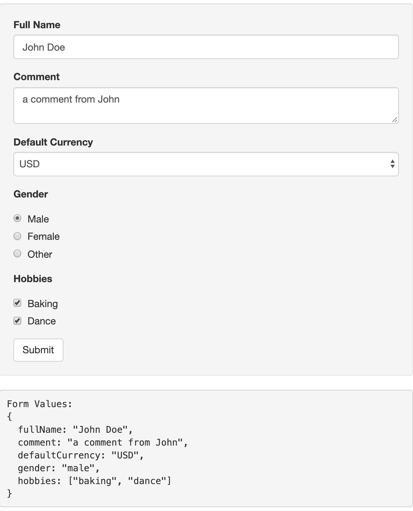
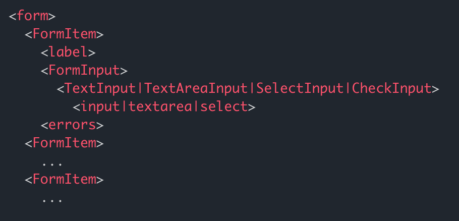

We are going to create a single component that supports text, textarea, select, radio, and checkbox. It will absorb all implementation differences for different inputs and will allow us using a unified component in our Formik forms.

When I start on a new project, I always try to abstract specific libraries away by defining my own components. This brings some benefits

* Simplify the code by moving the complex/common part into my custom component.

* Have the ease of changing the underlying dependency without going through a crazy refactoring, but rather only updating my custom component

This time we are going to create a component that seamlessly works with any input type. Then we’re going to integrate it with react-bootstrap without touching any of our forms, but just updating our custom input component.

Let’s see what we’re building first before going into implementation details. This is how our form will look like



And here is how we are going to define our form. It’s simple, clean, easy-to-read, right?

`gist:49574a6b8f75a664069babc0789a79ad`

Ok, now let’s start implementing it.

## Component structure

To make it easier to understand, you can see the structure of the components below. In the following sections, we are going to implement FormItem, FormInput, TextInput, TextAreaInput, SelectInput, and CheckInput.



## Creating the container component

`gist:94282b147a4b1a2e36d566aee54dbb46`

This will contain whatever a form field requires: a label, an input field, and validation errors. Line 8 renders the label if user provided the label prop. Line 10 renders the input component and line 12 renders the validation errors if there is any.

You might be asking where `props.formik` came from. It is added in the props by [connect](https://jaredpalmer.com/formik/docs/api/connect) method we use in line 3. Now our component will have the full formik context.

You can also use Formik’s [Field component](https://jaredpalmer.com/formik/docs/api/field) which is aware of the Formik context without you doing anything. You just need to adjust this FormItem component to make it work with Field component.

## Deciding which input to render

`gist:1b9acc8b677cf8569b6fc6ef947d1c68`

This one is straight-forward. It just renders the correct input component based on the type prop and passes all props down to that component. We are going to handle radio and checkbox in the same component, namely CheckInput, since they’re quite similar.

## Implementing input components

Every prop you pass to the FormItem will eventually be passed into the actual input element except the ones we defined for our specific use

* `label` is used in FormItem to render the label, so it’s not actually a prop for the input field

* `options` is used to pass the list of options in select, radio and checkbox elements. It will be an array of options like
```
    [
      {value: 'val1', label: 'Option 1'},
      {value: 'val2', label: 'Option 2'}
    ]
```

In addition to the props passed by the user, we should also pass additional props to make it work with Formik such as `value`, `onClick`, `onBlur` etc. We’re going to handle the extraction of the input props in `extractInputProps` method. Let’s leave it’s implementation to the next section.

### TextInput and TextAreaInput

Here how we define our text and textarea inputs. Nothing fancy, just pass the props and render the input element.

`gist:4e199d7d939b9b3b533ef0bb947bb25d`

### SelectInput

Next, let’s define our select input. It’s similar to the previous ones, but we also need to render a list of options which were passed in the `options` prop in FormItem.

`gist:d7124feaf7d8f8f6ab8975c865cd9aed`

### CheckInput for radio and checkbox

Now combining above two, it’s not too hard to understand radio and checkbox. Radio/Checkbox behaves different than other input elements, which we will handle in `extractInputProps` method.

`gist:f80a01148cbaf9a960f8984c1150fce4`

## Defining extractInputProps method

This method will accept `props` and `option` as parameters. `option` will be passed only by select/radio/checkbox while rendering each option coming from `options` prop.

`gist:0d65b1407db520754d7c84cd6f3df978`

As you can see from line 6, all the props you passed in FormItem finally reached the actual input elements. But, `props` has more than input element needs. That’s why we use object destructuring on line 1 and remove `formik` and `options` from the props we pass to input element.

Now it’s time to use `formik` prop which we get with Formik’s `connect` method we used in FormItem component. `value`, `onChange`, and `onBlur` attributes are set to values/handlers provided by formik.

Almost done. The only thing left is the special handling of radio and checkbox. Let’s fill those parts in.

### Handing additional props for radio

Each radio button has it’s own `value`. Since they share the same input name, form value is set to the value of the one user clicks. Browser uses `checked` attribute to decide whether it should be rendered as checked/unchecked. So, we set `checked` as true if the value of the radio button we’re rendering is equal to the value set in the form.

`gist:47213cafeb5acf5eb87fed76b8cea60f`

### Handing additional props for checkbox

The default behavior for checkbox is usually not what web applications expect. If you have a group of checkboxes, and some of them are selected, your form values will be something like `{option1: true, option2: false, option3: true}`. But, most applications expect `['option1', 'option2']` as the value in their API. To achieve  this, we’ll override `onChange` method like below. Also `checked` attribute will rely on form value including the value of the checkbox being rendered.

`gist:688ed0ea43ede9e5d642b9fcbf523194`

## Putting it all together

Here is the full working example

<div class="embed-container">
  <iframe width="100%" height="400" src="//jsfiddle.net/merictaze/vcaukthm/embedded/js,result/" allowfullscreen="allowfullscreen" frameborder="0"></iframe>
</div>

You can easily change the input components and make it work with react-bootstrap as below:

<div class="embed-container">
  <iframe width="100%" height="400" src="//jsfiddle.net/merictaze/2jvcb87r/embedded/js,result/" allowfullscreen="allowfullscreen" frameborder="0"></iframe>
</div>
