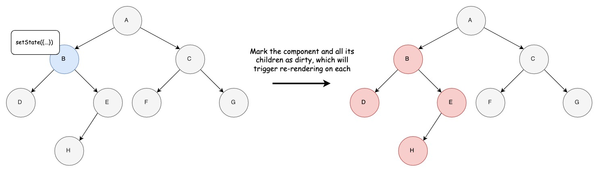

Although what react is doing looks quite complex, the underlying logic is very simple. And the easiest way to understand is just running some simple examples. We’ll dive into how react renders components and updates the actual DOM.

## Rendering React Components

In other words, this is calling the `render()` method of the component.

Although it might seem confusing at first glance, it’s actually super simple and straightforward. There is one simple rule: when you call `setState` in a component, that component and all of its children are marked as dirty. That means `render()` method will be called for each of these dirty components. While doing this, React does not even check whether props/state is actually changed, it just marks them as dirty blindly.

When you call `setState()` in component B, `render()` will be called for B, D, E, and H.



Let’s see it in action. 
In this example, we’re calling `setState` on the Parent. It will mark the Parent and Child component as dirty. So, every second, both Parent and Child will get re-rendered. Please note, we’re not even changing the value of `unusedField` , it’s still `1`, but React re-renders everything regardless.

<div class="embed-container">
  <iframe width="100%" height="400" src="//jsfiddle.net/merictaze/3ow61faq/embedded/js,result/" allowfullscreen="allowfullscreen" frameborder="0"></iframe>
</div>

When we move `setState` to the Child component, only child will get re-rendered every second while Parent is rendered only once.

<div class="embed-container">
  <iframe width="100%" height="400" src="//jsfiddle.net/merictaze/ko2La8jg/embedded/js,result/" allowfullscreen="allowfullscreen" frameborder="0"></iframe>
</div>

Some of you might be asking “*OK, when state changes, component and its children re-renders, but what about props?*”. Let’s say component has `props.firstName`. Since it’s a prop, it means it is passed by its parent (parent can also be a HOC such as redux’s `connect()`). If you keep following `firstName` prop, it will eventually be defined as a `state` variable in one of the ancestors. If `state.firstName` is changed using `setState()`, it will trigger a re-render for that ancestor and all of its children. That means all the components which have `state.firstName` and  `props.firstName` also get re-rendered. So, all components will be showing the latest value for `firstName`. That's why React only cares about `state` not `props` while deciding on whether to render a component. 

That’s it about default component rendering. Easy peasy! This simple logic will work great for most of the applications. If you have a complex application, you might need to fine-tune this behavior. Now, let’s see some ways of doing that.

### Using shouldComponentUpdate

When react marks a component as dirty due to `setState()` call, it calls this method to decide whether to re-render the component and its children. By default, this method returns `true` . That’s why they are all re-rendered on every `setState()` call. You can override this method and tell React when you want your components to get re-rendered, and when it's safe to skip.

In below example, since we know `unusedField` is not needed in our component, we can ignore it. Also instead of re-rendering the component on every `setState` call, we can tell to re-render only when the actual value of `usedField` changes.

Although we call `setState()` every second for two fields, nothing will be re-rendered as `state.unusedField` is not used in `shouldComponentUpdate()` and `state.usedField` is always `1`. So, `shouldComponentUpdate` will return false.

<div class="embed-container">
  <iframe width="100%" height="400" src="//jsfiddle.net/merictaze/ynpLavwt//embedded/js,result/" allowfullscreen="allowfullscreen" frameborder="0"></iframe>
</div>

When we actually change the value of `state.usedField`, both Parent and Child will get re-rendered every second since `componentShouldUpdate` will return true.

<div class="embed-container">
  <iframe width="100%" height="400" src="//jsfiddle.net/merictaze/efuxgms4/embedded/js,result/" allowfullscreen="allowfullscreen" frameborder="0"></iframe>
</div>

It’s suggested not to use `shouldComponentUpdate()` unless you really know what you’re doing and need to optimize the component really bad. It’s because in real world, your component will not be as simple as the one above. You’ll have tons of props/state with complex JSON and it will get hard to keep `shouldComponentUpdate` up-to-date. If you add a new prop and forget to add in the method, your component will not re-render and good luck debugging it. 

Another case might be you only care about some nested fields in a prop. Say you have a prop like this

```javascript
order: {
  orderId: '12345',
  shippingDetails: {
    deliveryDate: '2019-10-10 12:00',
    status: 'IN TRANSIT'
  },
  customerName: 'John Doe'
}
```

You only care about `props.order.shippingDetails.deliveryDate` and `props.order.orderId`. You can compare these two specific fields in your `shouldComponentUpdate` method.

```javascript
shouldComponentUpdate(nextProps, nextState) {
  return this.props.order.orderId !== nextProps.order.orderId
    || this.props.order.shippingDetails.deliveryDate !== nextProps.order.shippingDetails.deliveryDate;
}
```


What if some developer decides to use `props.order.customerName` in the component and forgets to add this field to `shouldComponentUpdate` method? React will not re-render the component when `customerName` changes. One way to prevent this is using a deep equality check on `props.order` which will compare every single nested field in the object. (but, please don’t do this)

```javascript
shouldComponentUpdate(nextProps, nextState) {
  return !deepEqual(this.props.order, nextProps.order);
}
```

If you don’t want to care even individual props, you can do something like below and your `shouldComponentUpdate` will always be up-to-date. (please don’t do this either)

```javascript
shouldComponentUpdate(nextProps, nextState) {
  return !deepEqual(this.props, nextProps)
    || !deepEqual(this.state, nextState);
}
```

This might get super slow easily. At this point, you may realize the importance of immutable objects. If you create a new `order` object whenever `order.shippingDetails.deliveryDate` or any other field changes, you wouldn’t need to compare any sub-field. As long as the old and new references are the same (i.e. `this.props.order === nextProps.order`), you are sure nothing changed in this object. If they’re not the same, that means some field somewhere in `order` was changed, so no more `deepEqual`.

So, with everything we learned so far, this seems like the best way to implement `shouldComponentUpdate()` as long as you don’t mutate sub-fields in your state. ( `shallowEqual` will compare top-level fields only like `this.props.field1 === nextProps.field1 && this.props.field2 === nextProps.field2`)

```javascript
shouldComponentUpdate(nextProps, nextState) {
  return !shallowEqual(this.props, nextProps)
    || !shallowEqual(this.state, nextState);
}
```

Guess what? This is exactly what PureComponent does. That’s why it’s the suggested approach over using `shouldComponentUpdate()`. It’s safer, faster with one rule, that is making state fields immutable.


### Pure Components

If you remember, default implementation for `shouldComponentUpdate` was returning true all the time. So, when you extend `React.Component` in your component, that's what you get. But, you have another option, extending `React.PureComponent` to have a better implementation of `shouldComponentUpdate` as long as you promise you'll keep it pure. And its implementation is exactly what we've seen in the previous part, shallow checks on `props` and `state`. Now let's check some examples.

First, let's see the beauty of PureComponent. In the example below, we call `setState` every second, and update order object at random times.

<div class="embed-container">
  <iframe width="100%" height="400" src="//jsfiddle.net/merictaze/L80sjoxp/embedded/js,result/" allowfullscreen="allowfullscreen" frameborder="0"></iframe>
</div>

As you've realized, render counter does not increase every second although you call `setState()` every second. It re-renders the components only when `order` object is changed.

Now, let's see what could go wrong if you don't use PureComponent properly. Here, we're going to update a field in `order` object in-place and call `setState` with that. If you were extending `React.Component`, it would just work since you call `setState()` and `shouldComponentUpdate()` always returns true. However, when you use `React.PureComponent`, shallow equality check in `shouldComponentUpdate` will return false since reference of `order` object hasn't changed. So, no re-rendering and you won't be able to see the latest value of the `customerName`.

<div class="embed-container">
  <iframe width="100%" height="400" src="//jsfiddle.net/merictaze/fcm8begw/embedded/js,result/" allowfullscreen="allowfullscreen" frameborder="0"></iframe>
</div>

## Rendering DOM

Every time you make a change in the actual DOM, it triggers a bunch of events and browser needs to do  some more stuff which is time-consuming. Because of that React came up with this idea of Virtual DOM. It’s a simplified JSON representation of the DOM. No events attached to elements and also browser does not care when you change it. It’s just the elements, their attributes and their children in a JSON object. It makes it cheap to make changes while rendering React components, and then React finds an efficient way of updating the actual DOM by diffing the old and new virtual DOMs.

It’s an internal React logic and there is not much you can do about it. But, it’s good to know how it works so that you create your components in a way that it causes fewer DOM updates. However, the problem is that React can change the logic any time as it’s an internal implementation detail. So, better not to rely on anything on this part as it can change any time.

More on how React updates the actual DOM can be found here https://reactjs.org/docs/reconciliation.html

## Wrap up

Don't go the route of premature optimization. Just go with the default behavior. When you realize re-rendering some components is really concerning and causing performance issues then try to optimize it by overriding `shouldComponentUpdate()`.

If you're confident of the purity of your components or using libraries like `immutable-js`, which ensures you won't be able to make in-place updates to your `state`, then it's better to go with `React.PureComponent` than implementing your own `shouldComponentUpdate()` as it gives less room for error and shallow equality check is cheap. 