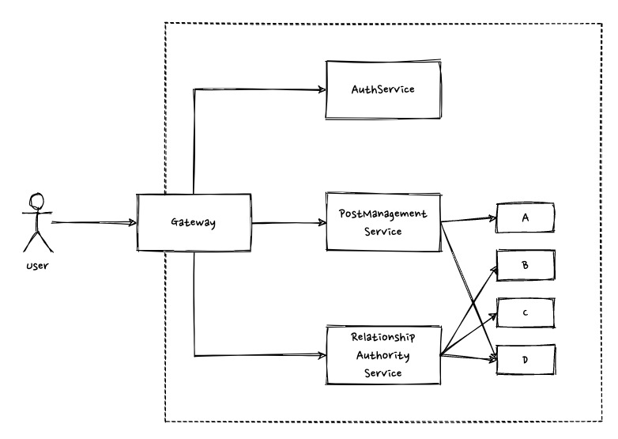

System design questions can be asked for any level with different expectations from the candidate, but to get a Senior offer, you have to rock this round. Practice makes perfect - like for anything else, it applies for system design interview too. So, keep practicing without taking shortcuts, practice as if it’s the real interview and always follow the same steps to make it perfect.

This is based on my personal experience over the years in the interviews I conducted as well as the ones I was the candidate, which turned into a senior job offer. Feel free to adjust based on your needs.

<figcaption>Photo by <a href="https://unsplash.com/@louisnardsophie">Sophie Louisnard</a> on <a href="https://unsplash.com">Unsplash</a></figcaption>

### Step 1: Clarify the requirements

Even if the question is “Design Instagram”, and you already mastered it during preparation, don’t jump to the solution just yet. It will be a 99% rejection for a senior position. Start clarifying the requirements and listing down the features

* Who is going to use it?
* What’s the expected number of users
* What’s the expected number of requests per second
* Which countries/languages are we supporting
* Any privacy/GDPR concerns
* What features do we want
    - Should we support image, video, or both
    - Do we need Follow/Unfollow
    - Do we need instant messaging
    - What about comment, likes, hashtags etc
* What are non-functional requirements: Scalability, Availability, Fault tolerance, etc

You might feel strange asking all these questions for a widely known app. But please don’t, and ask even very obvious questions. After this part, you’ll get a tick in interviewer’s notes: “Deals with ambiguity and ask questions to clarify the problem: check”.

### Step 2: Define Entities

Before throwing all those boxes: “Service X”, “Service Y”, “Service Z” and their interactions, just take a step back and define what kind of entities you need. Some people prefer defining the APIs first, but I feel more comfortable figuring out the main entities first and defining APIs around those.

Based on the requirements and features you discussed in the previous step, start listing down the entities and what fields they have. For example, you can start with something like this

* Post: postId, content, mediaType, mediaLink, userId, creationDate
* User: userId, username, profilePhoto
* Relationship: followerUserId, followeeUserId

### Step 3: Define APIs

List of the features you collected in step 1 and the entities you defined in step 2 will construct your APIs here. Let’s say interviewer requested the following features

* Post images only
* Allow user to edit the post
* Support follow/unfollow
* News feed to see all the posts from all users

Based on that info, the APIs you’re going to need will be something like below (I know there is another 1M way of doing this):

* /posts (GET): Returns all the posts (probably paginated for infinite scroll)
    * method: GET
    * input: GetPostsRequest
        * lastPostId for pagination
        * numberOfItems
* /posts (POST): Creates a new post
    * method: POST
    * input: CreatePostRequest
        * content,
        * mediaType and mediaLink or the file itself if you’re not uploading it to the CDN directly from the UI
* /posts/{postId} (POST): Updates an existing post
    * method: POST
    * input: UpdatePostRequest - similar to CreatePostRequest with a postId
* /relationships/{userId} (POST): Follows/Unfollows a user
    * method: POST
    * input RelationshipRequest
        * followeeId
        * followed (true to follow, false to unfollow, or you can create a DELETE method to unfollow and remove this flag)

It might be a good idea to mention that in step2 you designed DB entities while here you’ll use API entities which are similar to DB entities with small differences:

* postId will be generated at the backend, so it will not be part of the CreatePostRequest
* same for userId, it will most likely be extracted from some encrypted token coming in the header

### Step 4: Draw High-level Architecture

Now, it’s the right time to start drawing those boxes and show off your microservice architecture skills. First, define the main components you’re going to need, and add things like “Management”, “Authority”, “Processor” etc in the service name ;)

* AuthService
* UserManagementService
* RelationshipAuthorityService
* PostManagementService

A common approach is putting a Gateway that users will talk to, and initiate calls to your backend services from this gateway. For example, to create a new post, send your HTTP request to the Gateway and Gateway will first talk to AuthService to extract the user info and make sure user is authenticated/authorized and then call PostManagementService to create the post. Your diagram will look something like this:

After this point, start throwing all system design concepts you know:

* Put a CDN here to serve JS/CSS file
* Another CDN there to store media files like images and videos
* Put a LoadBalancer in front of AuthService as all requests will have to talk to AuthService first and you need to scale it out and make it fault-tolerant
* If AuthService DB is having a bad day, your product might be completely unusable, so let’s add some replication and sharding for that DB
* Since it’s a public feed and everyone will see the same feed, there is no need to query PostManagementService DB every time, put a cache in front of it to make feed rendering super fast
* If you need notifications for things like new followers, likes etc, that’s a great place to show your pub/sub and message queue knowledge. Publish events from RelationshipAurhorityService for follow/unfollow actions and PostManagementService for new posts, and subscribe to those with a message queue which will be consumed by NotificationService
* For transient issues in some systems, add retries with exponential backoff for service calls. Add meaningful timeouts so that you don’t wait for minutes to get a simple response.
* Show where system might fail and how you can fix single point of failures in the system. When you say I’ll have multiple nodes for AuthService and a LoadBalancer in front to not have a single point of failure, interviewer might ask “What if Load Balancer fails?”(in case you’re curious, you can have multiple nodes for LoadBalancer as well and use DNS Round-robin). So, ask yourself where system can fail while designing and show interviewer that you also consider these kinds of things.

Please note experienced interviewers will dive deep into these concepts. So, make sure you know what they do, how they work and advantages/disadvantages between different approaches.

### Step 5: Monitor the System Health

If all went smoothly, you might have some time at the end. At this point, interviewer will most likely ask how you measure the system health, what kind of things you monitor.

A common approach is having monitors like below and creating alarms with some threshold for each, which will notify the team automatically if something is wrong. This is not the exhaustive list for a service you’re launching to production, but it should be enough for the interviewer.

* Latency/Number of request/Error/Fault count for all incoming API calls to your service and all outgoing API calls from your service to others (service, db etc).
* Disk, Memory CPU usage and utilization for each node of the service
* If you use things like message queues etc, you might monitor things like the number of messages in the queue, the oldest message in the queue etc.

### Summary

Here are all the steps. Write it on a paper, put it next to your screen and keep practicing.

* Step 1: Clarify the requirements
* Step 2: Define Entities
* Step 3: Define APIs
* Step 4: Draw High-level Architecture
* Step 5: Monitor the System Health

Good luck with your interview!
