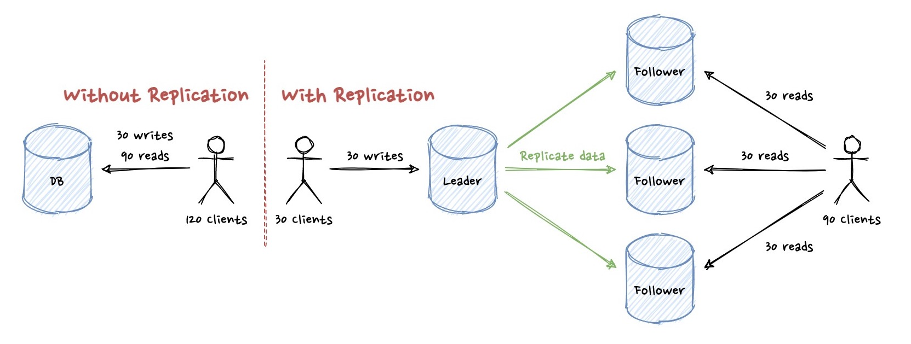

Maybe you’re just getting started with distributed systems and system design, or you just need a quick recap for your upcoming interview. In either case, in this post, you’ll find the most common concepts of system design and the most important aspects of them. Let’s get started.

<figcaption>Photo by <a href="https://unsplash.com/@jessbaileydesigns">Jess Bailey</a> on <a href="https://unsplash.com">Unsplash</a></figcaption>

## Horizontal vs Vertical Scaling

When you have a single node(host/server) and 300 users using your app, everything might work flawlessly. When you hit 600 users, the node you have might not be able to keep up with the incoming number of requests with the hardware it has. At this point, you need to scale and you have two options.

You can improve the hardware on the same node by doubling the memory or CPU, or whatever you need so that you can accommodate 600 users with a single machine. This is what we call **scaling up** or **vertical scaling**. This solves the immediate problem but you cannot keep adding more memory or CPU to the same machine forever. At some point, you’ll hit the max hardware a machine can support.

Another approach is putting new nodes that serve the incoming requests/tasks together, which is called **scaling out** or **horizontal scaling**. While this brings a lot of challenges, it allows you to scale almost infinitely, hence the recommended approach for most usecases. In addition to that, doubling the number of nodes is cheaper than doubling the hardware in a single node.

## Load Balancing

One way or another, you’ll need to scale out (scale horizontally) in most parts of your system. When you have multiple nodes, the question becomes how to balance the load between these nodes equally so that you can utilize the nodes/hardware as much as possible.

Let’s say you have a client trying to call OrderService. There are 3 main approaches to achieve that:

1. **Client-side load balancing:** Client knows all the instances of OrderService and decides which instance to call, usually using a library provided by the service
2. **DNS load balancing:** DNS server knows all the instances of OrderService and decides which instance to resolve the given URL to
3. **Server-side load balancing:** A separate server(LoadBalancer) knows all the instances of OrderService and decides which instance to call. This server sits between client and OrderService.

With a server-side load balancer, you’re solving the scaling and single point of failure problems of your nodes (app servers), but then Load Balancer becomes the single point of failure if it’s just a single server. One common approach is having multiple load balancers and having DNS Load balancing between those to make sure failure in a single LoadBalancer node will not make the whole service unreachable.

There are different techniques to balance the load. Most of them apply to server-side load balancing as you don’t have much knowledge of what’s going on in the first two approaches.

* **Round-robin:** Requests/Tasks are distributed to all nodes in the group in rotation (sequentially)
* **Least connections:** Request is sent to the node with the least number of active connections at the time of the request
* **Least response time:** Request is sent to the node with the lowest latency at the time of the request
* **Source IP Hash:** A hash is generated based on the client’s IP address. This hash is used as a key to select which node to send the request. All requests coming from the same client will generate the same hash and sent to the same node given the node is still healthy.

## Microservice Architecture

If you’re building a simple app, having a single service with multiple APIs to fulfill all your needs is the default choice. However, when the system evolves and each aspect of your app becomes complicated pieces with its own complex business logic, and most likely owned by different teams, you’ll realize it might be better to split each aspect of your business into separate services and define contracts/APIs between them without sharing anything else.

As soon as your application grows, you can break it into different microservices such as entity life-cycle management for orders, Notification, Invoicing, Advertisement, Fulfilment,  Analysis and Reporting, and so on.

You decouple different concerns of the business or domain models into their respective services to evolve them easier. In a microservice architecture, there are a bunch of services fulfilling one or multiple aspects of the business. They talk to each other to fulfill different flows and they’re usually aware of each other with a **Service Registry** (concept is called **Service Discovery**), that knows which services exist, what their nodes’ or LoadBalancers’ addresses are, etc. 

Instead of letting external users/clients calling each service, a more common approach is adding a Gateway that will be the bridge between users and microservices. Gateway can offer REST APIs for users to call and a central Auth logic to make sure users are authenticated, while microservices can use different protocols for communication (such as RPC) and auth.

## Database

When it comes to what type of database to use, there is usually a hot conversation, if not a fight, between SQL and no-SQL. At a high level, it’s good to know the main distinction between the two:

* **SQL:** your system has relational data and multiple/unpredictable query patterns
* **no-SQL:** your system has flat data, fewer/predictable query patterns, and needs to scale infinitely

There are also some cases that fit in between. For those cases, both solutions should work for you.
Most DBs use replication and sharding together to achieve better availability, scalability, and many other similar distributed system terms.

### Replication

Replication is duplicating data in different nodes, data centers, or regions. It provides

* scalability on reads as there are multiple nodes with the same data that can serve the request
* availability and fault tolerance as losing some nodes will not take the whole system down. There will still be some other nodes with all the data that can serve the request
* lower latency for the cases where replication happens cross-region. Each client can call the replica server closer to their location

Whenever a client writes something, it goes to the leader. Later on, data is replicated at the followers (green arrows below). Replication process can be

1. **fully-sync replication**, which will cause delay on the writes as the client has to wait for data to be written to the leader and replicated at all followers synchronously
2. **async replication**, which might cause inconsistency for the cases async replication delays for some reason
3. **semi-sync replication**, which tries finding a middle-ground between above approaches. Data is replicated synchronously in some nodes and asynchronously for others.

While the diagram above shows single-leader replication, please be aware there is also multi-leader and leader-less replication with their own advantages and disadvantages.

### Sharding (Horizontal Partitioning)

It allows you to spread reads/writes evenly across nodes by partitioning the data into multiple nodes. Each shard/partition will own some part of the data (i.e. some rows of a table).

While sharding, one of the important aspects is how to split data into multiple nodes, what’s the criteria to decide which data should be owned by which node. There are two common approaches
 
**1. Range-based sharding**
You divide the rows into ranges based on the primary key’s value. Each range is assigned to a node. For example, if you have a user table whose primary key is username, you can shard the data based on the first letter of the username:

* username starts with [a, e] → Node 1
* username starts with [f, m] → Node 2
* username starts with [n, z] → Node 3

As data is sorted in the nodes, it’s easier to run range queries like “get all users whose username starts with ar”. On the other hand, it’s hard to split the data into nodes uniformly as the initial ranges assigned to nodes might skew in time based on the incoming data. 

**2. Hash-based sharding**
Hash-based sharding solves the uniform distribution issue of range-based sharding by sacrificing the efficient range-queries. Hash-based sharding takes the primary key or the whole row, hashes it, and uses the hash value to decide which node to go.

* hash(data) % 3 == 0 → Node 1
* hash(data) % 3 == 1 → Node 2
* hash(data) % 3 == 2 → Node 3

The hash function consistently produces the same hash for the same data. On the other hand, even slight changes in the data will create a completely different hash value. Now that similar data does not go to the same node like in range-based sharding anymore, data will be distributed more uniformly to the nodes. Due to the same reason, hash function causes losing the relationship between the actual value and which node it goes, hence lookup by primary key is easy but range queries are not possible.

## Caching

Each application stores some data one way or another. It can be static files in some storage or some information in a DB. Your data will grow in time and the access pattern of your app will not require most of the data for 99% of its usecases. Caching is storing the parts of your data that will be needed the most somewhere that is faster than going to the actual storage/DB. 

Caching can be in many forms. Some examples are

* Browser can cache files/responses to save on the network requests to the backend in the client’s disk
* Each application server can cache the response from its dependent services or DB in memory
* Distributed cache can store the commonly accessed data from DB in memory
* CDN can cache static files requested by the users frequently in its storage

This convenience comes with a cost. Now that you have two places to look for something, DB and cache. It’s non-trivial to keep them in sync.

1. **Write-through cache:** Simultaneously update the DB and cache. DB write can either be done by the application server (the one calling the cache), or cache can trigger a write to the DB directly. Success/Failure response will be returned back to the user once both write operations complete synchronously
2. **Write-back cache:** Application server just deals with the cache and does not talk to the DB directly. Changes made to the cache periodically (or based on some other configuration) will be sent to the DB asynchronously.

Cache is relatively more expensive(especially in-memory caches) than DB. Hence, it only stores the part of your data that is needed the most for your usecases instead of the whole DB. Given that, at some point, you’ll hit its limits. Then the question is which one to evict from the cache to make room for the new one

1. **Least Frequently Used (LFU):** Every time you access an item, you increment its access count. When you need to evict something, you evict the one with the lowest counter.
2. **Least Recently Used (LRU):** Every time you access an item, you set/update the time it was accessed. When you need to evict something, you evict the one with the oldest timestamp
3. **First In First Out (FIFO):** Does not matter how many times or how recently an item was used, the item which was added to the cache the first will be evicted. Unlike LRU, accessing an existing item(cache hit) will not update its order.

## CDN

Most web and mobile apps rely on static files. These static files can be the HTML/CSS/JS files as well as images or videos. In the very old days, these static files were being stored in the server disk together with the web app. Later on, people started moving to Object Storage solutions such as AWS S3, Azure Blob storage, or Google Cloud Storage. This worked way better than storing them next to your web server as it provided better separation between the application code that’s accessed through APIs and asset files whose size and access patterns are different.

But, there was still a problem. This storage, often called origin server, which stores all your assets is still on some datacenter somewhere in the world, let’s say Seattle. Anyone using the app from the east coast, Europe, or Asia is also getting these files from Seattle, which will cause a lot of latency. That’s where CDN, Content Delivery Network, comes into play. It’s nothing but a cache. You still have your Object storage(or any other storage) as your origin server, and you distribute your CDN servers across the world. Users from Europe do not need to call your origin server in Seattle anymore, there is a CDN server in their city or country which is caching these static files based on the access pattern. Even if the requested file is not in the CDN server, CDN server will fetch it from Origin server and cache it for the upcoming requests.

## Message Queues and Pub/Sub

Breaking the synchronous flow and adding a message queue or Pub/Sub in between is very useful for a variety of use-cases. It provides async service communication and helps to decouple the systems. They look similar, but they’re quite different. In some cases, they can even be combined.

There are two sides of a **Message Queue**. On the left side, one or more producers are producing tasks/messages while on the right side, one or more consumers are consuming those tasks/messages. Each task needs to be completed by one of the consumers. Therefore, each message is sent to only one of the consumers, unlike pub-sub pattern. After the consumer gets the message from the queue and processes it, it will be removed from the queue.

For example, if you have a video processing app, you might want to upload the video, send it to a message queue for later processing, and return success to the user immediately. Now, some consumers, most likely with more CPU power than the ones accepting the request from the user, will start consuming the messages and processing the videos. Each video will be processed by one of the consumers. If users are fine with waiting a day to get the processed video, you can even have way fewer consumer nodes and consume messages at a slower rate to save a ton of money.

Message queues are useful for point-to-point communication, but what if you’re the owner of an entity that is needed by multiple systems. In this case, you need a publisher on the left that is publishing messages to a topic that is needed by multiple systems, and on the right, there are subscribers which will get all the messages sent to the topic. This is what we call **Pub/Sub**.

 For example, you own the FlightOrderService, and whenever there is a new order

* NotificationService needs to send an email to the customer
* TicketService needs to generate the tickets

You might think you can create 2 message queues, one for each subscriber, and ask FlightOrderService to send the order event to those 2 queues. Even though it works, Pub/Sub is a better architecture for this problem as there will be additional subscribers along the way. FlightOrderService will publish a message to the topic and other services will subscribe to the topic. If you publish 3 new orders, NotificationService and TicketService will get all 3 messages. The subscriber can use a message queue to put the messages coming from the topic for later processing or directly trigger some compute to immediately work on the task.

## Wrap up

These concepts are foundations of most systems, distributed or not. It is good to know at least the basics and what they are used for so that you are aware of your options while designing systems. I tried explaining the concept at a high level without going into details as it would be 15-20 pages otherwise. If you realize there are things you don’t know or you require a deeper knowledge of, I highly recommend reading more-in-depth posts specifically for the concepts you need.
