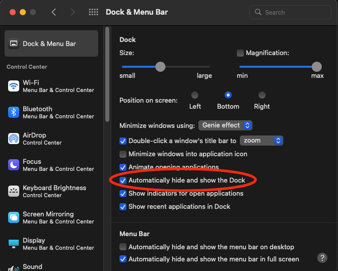
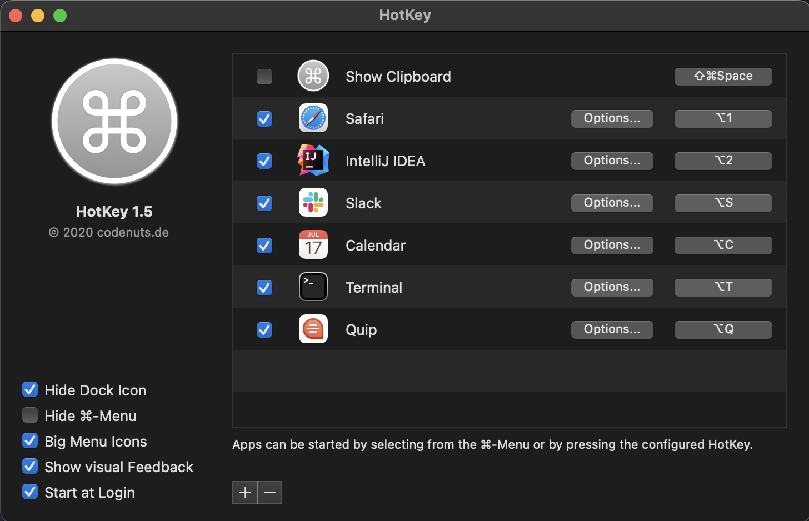

Multitasking is the source of all evil. Until recently, I also liked having multiple screens and multi-tasking like many others. It was great to code on one screen while reading the slack messages and emails on the other screen. But, it was so easy to get distracted by continuous incoming notifications while trying to read, write or code something. Often, I was feeling tired in the middle of the day because continuous context switching was draining my energy and destroying my focus on the task I was working on. 

After realizing this, I implemented some changes in my workflow. The steps below explain how I eliminated every single distraction in my day-to-day work to have more focus time and better productivity.

While I am using these on my mac, the ideas can be applied regardless of what operating system you're using.

<figcaption>Photo by <a href="https://unsplash.com/@carlheyerdahl">Carl Heyerdahl</a> on <a href="https://unsplash.com">Unsplash</a></figcaption>

## Only 1% of the notifications need immediate attention

How many times did you have to start reading from the beginning of a paragraph again and again due to notifications showing up, or even worse, notification sound chiming continuously? And how many times those really required your immediate attention?

Disable the majority of your notifications if not all. Isn’t the whole point of slack and email async communication anyways? So, why get disrupted synchronously for every single notification?

If you still need to act on some things urgently, you can always enable selective notifications. For example, you can suppress all email notifications but only allow for emails coming from your manager.

## You need only one screen

In the last 4 years, I’m using only one screen. If I’m working at my desk, I close the lid of my laptop and just use my external monitor. This reduces my level of distractions significantly as there is only one screen I need to look at, and there are only so many things you can fit on one screen. That means I have space only for the app I'm currently using, or maybe two. This way I can focus fully on what I'm currently working on without getting distracted by the things happening on another screen.

## Create your layout using multiple desktops

I don’t use multiple screens, but I do use multiple desktops, also called spaces. I create multiple desktops for a different sets of tools. 

On my first desktop, I keep my communication apps. I put my email, calendar and slack side by side. Another desktop is for coding. Usually, I only keep IntelliJ or VSCode in full screen because I open different files side by side. Another desktop for reading, which has things like safari and my note-taking app

I also create ad-hoc desktops based on what my current task requires. If I'm debugging, I might have IntelliJ and PostMan side by side. If I'm reading docs, I have Safari and my note-taking app side by side

It is extremely easy to switch between these desktops using Ctrl+Left and Ctrl+Right if I’m on my keyboard. or I use my mouse shortcuts to switch between desktops.

## Out of sight, out of mind

Having Slack or Mail app on the dock with some numbers on it was also distracting me. It wasn’t easy to continue my current task while knowing I have new slack messages or emails. Neither clicking it to see what it is nor trying to ignore it but still thinking about what it might be help with productivity. I found the only solution to this was not seeing it and knowing it at all.

I decided to go to my macOS “Dock & Menu Bar” settings and enable “Automatically hide and show the Dock”. This way I don’t get distracted by the notification counts on the dock icons and focus on the task at hand. Whenever I complete the task or worked long enough, only then do I check if there is any notification that requires my attention.

  
Another benefit of this approach is having more screen real estate because the dock does not take up any space anymore.

## Speed matters

So far so good, but what if you need to switch between apps quickly? Now that you have a single screen, apps are split into desktops and you don’t even have a dock to quickly open the apps, isn’t it too time-consuming to switch between apps when you need to?

Well, it isn’t. To be honest, trying to grab the mouse, move it over to your dock, try to find the icon of the app you need and click it is slow by itself anyways. Even if you don’t want to try any of the suggestions I mentioned earlier, you need to try this one.

There are various tools for this. Currently, I’m using an app called [HotKey](https://apps.apple.com/us/app/hotkey-app/id975890633). You can assign any shortcut to open any app. So I have a setting like:

it takes a bit of practice in the first couple of days. But after that, your brain will be on autopilot and you'll switch between apps in milliseconds. I don’t think there is anything that can beat the speed of switching between apps this way.

## Summary

1. Turn off notifications and only allow important ones.
2. Resist the idea of having multiple screens
3. Make use of using multiple desktops feature and create a layout that works for you
4. Automatically hide&show the dock to not let icon's notification count badge distract you
5. Use shortcuts to switch between apps

That's it for now. Let me know if there are any other tools or tricks you use, or if you want a deeper dive into any of the topics covered here.